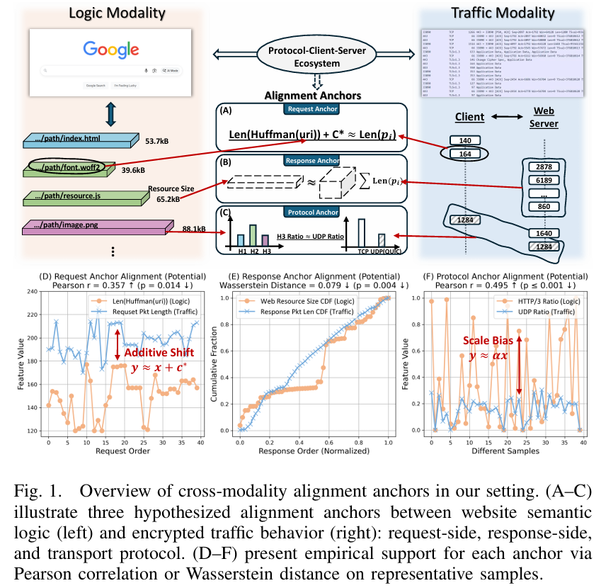
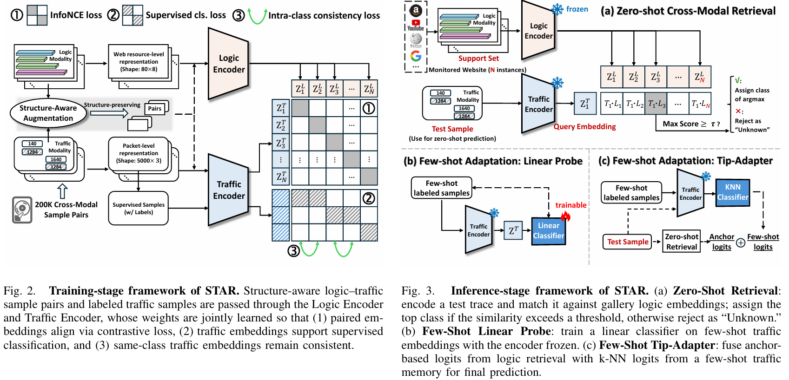
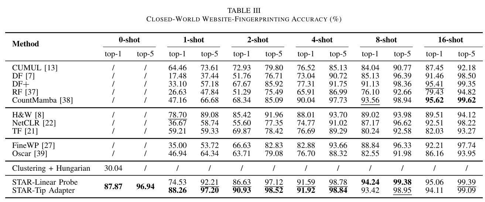

# STAR-Website-Fingerprinting

[English](README.md) | [中文](README_zh.md)


[](https://infocom2026.ieee-infocom.org/)
[](https://scholar.google.com/scholar?hl=en&as_sdt=0%2C5&q=website+fingerprinting&oq=website+)


<p align="center">
  
</p>

The code and dataset for the paper **STAR: Semantic-Traffic Alignment and Retrieval for Zero-Shot HTTPS Website Fingerprinting**, 
accepted in *IEEE International Conference on Computer Communications (INFOCOM) 2026*.  

- 📄 [Read the Camera-Ready Paper](docs/STAR_infocom26_1137_rfp.pdf)  
- 🌐 [Read on arXiv](https://arxiv.org/abs/2512.17667)

⚠️ **For research purposes only.** ⚠️

If you find this repository useful, please cite our paper:

```bibtex
@inproceedings{cheng2026star,
  title={STAR: Semantic-Traffic Alignment and Retrieval for Zero-Shot HTTPS Website Fingerprinting},
  author={Cheng, Yifei and Zhu, Yujia and Li, Baiyang and Deng, Xinhao and Cai, Yitong and Ren, Yaochen and Liu, Qingyun},
  booktitle={IEEE INFOCOM 2026-IEEE Conference on Computer Communications},
  pages={1--10},
  year={2026},
  organization={IEEE}
}
```

*The official IEEE INFOCOM version will be updated once published.*


The processed dataset and pretrained checkpoints are publicly available via [Zenodo](https://doi.org/10.5281/zenodo.17060855)


> [!WARNING]
> ## Important Reproducibility Notice （2026.07.17）
>
> We have recently identified a potential reproducibility issue related to differences in packet-capture environments. The large-scale pretraining traces used in this work were collected on AWS instances with Linux Generic Receive Offload (GRO) enabled. Consequently, multiple TCP segments may appear as a single large packet record in the host-side PCAP, even though these large packets were not transmitted on the network in that form.
>
> Our evaluation was conducted across independently collected datasets and devices: the model was pretrained on the newly collected large-scale dataset, while downstream classification was evaluated using a previously published public dataset. However, the public dataset was also collected on AWS and therefore exhibited a similar packet aggregation pattern. This allowed the model to achieve reasonable cross-dataset performance, but did not sufficiently evaluate robustness to differences in packet-capture stacks. Traces collected locally, with GRO disabled or under different offloading configurations, may consequently produce substantially different packet-length sequences and degraded accuracy.
>
> We are actively investigating this issue. Potential solutions include introducing a preprocessing adapter that normalizes different packetization patterns, reconstructing a representation compatible with the original training distribution, and applying lightweight domain adaptation without repeating the full pretraining process. We will update this repository when a validated solution is available.


---
## 🚀 Key Idea and Findings

### Problem

Modern HTTPS mechanisms (e.g., ECH and encrypted DNS) hide traditional identifiers such as SNI and DNS queries. 
However, existing website fingerprinting (WF) methods still rely on *site-specific labeled traffic*, which makes them:

- expensive to deploy,
- brittle to website evolution,
- and incapable of recognizing previously unseen websites.

**Key question:**  
> Can we identify *unseen websites* from encrypted traffic **without collecting any traffic from them**?


### Key Observation

<p align="center">
  
</p>

We find that **encrypted traffic is not arbitrary**.

Even under full encryption, modern web protocols introduce *structural semantic leakage* that creates **consistent alignment anchors** between:

- website-level semantic logic (e.g., URI length, resource size, protocol usage), and
- encrypted traffic behavior (e.g., packet lengths, burst patterns, transport ratios).

We identify **three intrinsic alignment anchors**:

- **Request-side anchor**:  
  Request packet lengths correlate with Huffman-encoded URI lengths due to HTTP/2 and HTTP/3 header compression.

- **Response-side anchor**:  
  Aggregated response packet sizes reflect the total size of returned web resources.

- **Protocol anchor**:  
  HTTP/3 adoption is observable via UDP traffic ratios at the transport layer.


### Approach: STAR

<p align="center">
  
</p>

Based on these anchors, we reformulate website fingerprinting as a **zero-shot cross-modal retrieval problem**.

STAR learns a shared embedding space between:

- **Logic modality**: crawl-time semantic website profiles (resource-level structure), and
- **Traffic modality**: encrypted packet-level traces.

A dual-encoder architecture aligns the two modalities using contrastive learning, 
enabling encrypted traffic traces to retrieve their most semantically aligned website profiles —
**without requiring any traffic from target websites during training**.


### Main Results

<p align="center">
  
</p>

- **Zero-shot closed-world classification**  
  - 87.9% Top-1 accuracy over **1,600 unseen websites**

- **Open-world detection**  
  - AUC = **0.963**, outperforming supervised and few-shot baselines

- **Few-shot adaptation**  
  - With only **4 labeled traces per site**, Top-5 accuracy reaches **98.8%**

These results demonstrate that **semantic leakage, rather than header visibility, 
is now the dominant privacy risk in encrypted HTTPS traffic**.


---

## 👉 Reproducibility

This section provides step-by-step instructions to reproduce the main experimental results reported in the paper.

### 1. Environment Setup

All experiments are implemented in Python.  
Please first install the required dependencies listed in `requirements.txt`.

```bash
pip install -r requirements.txt
```

> We recommend using a dedicated virtual environment (e.g., `venv` or `conda`) to avoid dependency conflicts.

### 2. Dataset and Pretrained Model

We provide the **processed dataset** and **pretrained model checkpoints** required for reproduction via a publicly accessible Zenodo repository.

#### Required Files and Directory Structure

Please organize the downloaded files as follows:

```text
STAR/
├── STAR_dataset/
│   ├── (processed dataset files)
│   └── .gitkeep
├── STAR_model_pt/
│   ├── best_STAR_model.pt
│   └── .gitkeep
```

#### Pretrained Model

- Download `best_STAR_model.pt`
- Place it at:
  ```text
  /STAR_model_pt/best_STAR_model.pt
  ```
  
> 🔗 **Zenodo link:** https://doi.org/10.5281/zenodo.17060855

#### Notes on Data Availability

The dataset released in this repository is **preprocessed according to the input format required by STAR**, as described in the paper.

The **raw data** used in this work—including:

- over **170,000 website visits**,
- more than **100 GB** of raw traffic traces (PCAP format),
- and corresponding logic-side crawl logs—

is not publicly hosted due to storage and distribution constraints.
If access to the raw data is required for research purposes, please contact:

> 📧 chengyifei@iie.ac.cn


### 3. Running Experiments

All experiment scripts are located in the project root directory:

```text
STAR/
├── cw_zero_shot.py
├── cw_linear_probe.py
├── cw_tip_adapter.py
├── ow_zero_shot.py
├── pretrain.py
├── logic_encoder_8d.py
├── traffic_encoder_3d.py
```

We categorize experiments by **filename prefixes**.

#### 3.1 Closed-World Experiments (`cw_*.py`)

Scripts with the prefix `cw_` correspond to **closed-world evaluation**, including:

- **Zero-shot classification**

  ```bash
  python cw_zero_shot.py
  ```


- **Few-shot adaptation**

  - Linear probing

    ```bash
    python cw_linear_probe.py
    ```

  - Tip-Adapter-style adaptation

    ```bash
    python cw_tip_adapter.py
    ```


These scripts reproduce the closed-world results reported in the paper.

#### 3.2 Open-World Experiments (`ow_*.py`)

Scripts with the prefix `ow_` correspond to **open-world evaluation**, including rejection of unmonitored websites.

  ```bash
  python ow_zero_shot.py
  ```

### 4. Model Pretraining (Optional)

Users may also choose to **pretrain the STAR model from scratch** using the provided training script:

  ```bash
  python pretrain.py
  ```

#### Training Configuration

- Training follows the data scale and optimization strategy described in the paper.

- Default setting:

  - **200 epochs**

  - Approximately **4 hours** using **5 NVIDIA A100 GPUs** with data parallelism.

> ⚠️ Pretraining is computationally expensive and **not required** for reproducing the main results, as pretrained checkpoints are provided.


### 5. Additional Notes

- All random seeds are fixed by default for reproducibility.

- GPU acceleration is recommended for both pretraining and evaluation.


If you encounter any issues during reproduction, feel free to open an issue or contact the authors.

---

## 📌 License

This project is released under the Apache License 2.0.

