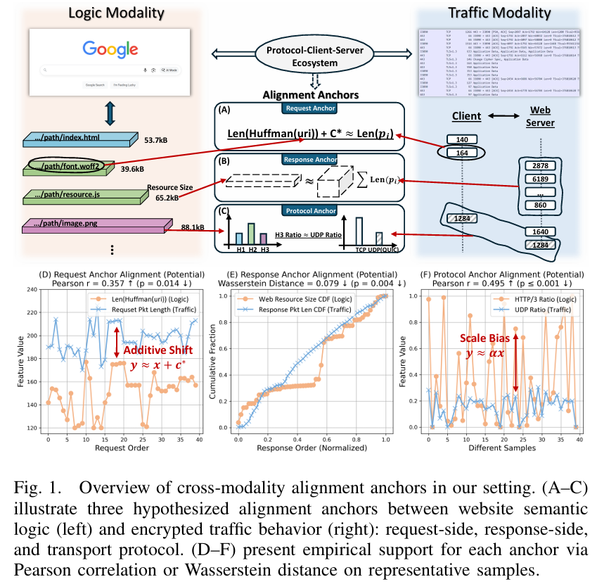
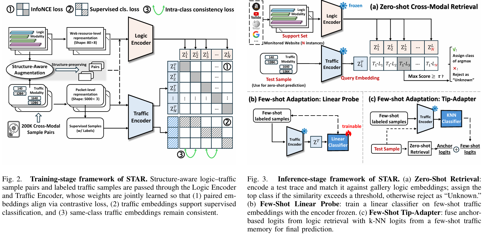
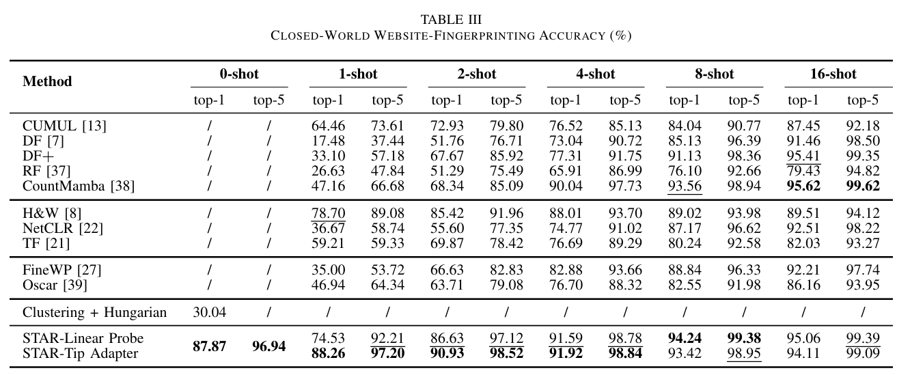

# STAR-Website-Fingerprinting

[English](README.md) | [中文](README_zh.md)


[](https://infocom2026.ieee-infocom.org/)
[](https://scholar.google.com/scholar?hl=en&as_sdt=0%2C5&q=website+fingerprinting&oq=website+)

<p align="center">
  
</p>

本仓库提供论文 **STAR: Semantic-Traffic Alignment and Retrieval for Zero-Shot HTTPS Website Fingerprinting** 的代码与数据集，
该论文已被 *IEEE International Conference on Computer Communications (INFOCOM) 2026* 接收。

- 📄 [阅读 Camera-Ready 版本](docs/STAR_infocom26_1137_rfp.pdf)  
- 🌐 [在 arXiv 上阅读](https://arxiv.org/abs/2512.17667)

⚠️ **仅供科研用途。** ⚠️

如果你觉得本仓库对你有帮助，请引用我们的论文：

```bibtex
@article{cheng2025star,
  title={STAR: Semantic-Traffic Alignment and Retrieval for Zero-Shot HTTPS Website Fingerprinting},
  author={Yifei Cheng and Yujia Zhu and Baiyang Li and Xinhao Deng and Yitong Cai and Yaochen Ren and Qingyun Liu},
  journal={arXiv preprint arXiv:2512.17667},
  year={2025}
}
```

*IEEE INFOCOM 的正式版本在公开出版后会在此更新。*

处理后的数据集与预训练模型 checkpoint 已通过 [Zenodo](https://doi.org/10.5281/zenodo.17060855) 公开发布。

---
## 🚀 核心思想与关键发现

### 问题背景

随着 Encrypted Client Hello（ECH）和加密 DNS 等机制的部署，HTTPS 中传统可见的标识信息（如 SNI 和 DNS 查询）正逐步被隐藏。
然而，现有的网站指纹识别（Website Fingerprinting, WF）方法仍高度依赖**针对每个网站采集的标注流量数据**，这使得它们在实际部署中面临以下局限：

- 需要持续、大规模地采集目标网站流量，部署成本高；
- 对网站内容和结构变化高度敏感，鲁棒性不足；
- **无法识别训练阶段未见过的新网站**。

**核心问题在于：**

> 是否可以在**完全不采集目标网站流量的前提下**，仅基于加密流量识别用户正在访问的、此前从未见过的网站？

---

### 关键发现：语义–流量对齐（Semantic–Traffic Alignment）

<p align="center">
  
</p>


我们的核心发现是：**加密流量并非完全随机。**

即使在 HTTPS 全加密的条件下，现代 Web 协议的设计仍会引入**结构性语义泄露**，使得网站的高层语义结构与其加密流量行为之间存在稳定的对应关系。

我们系统性地识别并验证了三类**跨模态对齐锚点（alignment anchors）**：

- **请求侧锚点（Request-side Anchor）**  
  由于 HTTP/2 和 HTTP/3 使用静态/动态表与 Huffman 编码进行头部压缩，请求数据包长度与资源 URI 的 Huffman 编码长度之间呈现近似线性关系。

- **响应侧锚点（Response-side Anchor）**  
  加密响应流量中数据包长度的累积特征，与页面中各资源文件大小的总和高度相关。

- **协议锚点（Protocol Anchor）**  
  HTTP/3 基于 QUIC/UDP 传输，其在服务器侧的使用比例可通过 UDP 流量占比在传输层被间接感知。

这些锚点并非偶然现象，而是源于现代 Web 协议栈在性能与效率上的设计选择，为跨模态建模提供了坚实的结构基础。

---

### 方法概述：STAR

<p align="center">
  
</p>

基于上述观察，我们将网站指纹识别问题**重新建模为一个零样本的跨模态检索任务**。

STAR（Semantic–Traffic Alignment and Retrieval）通过一个**双编码器结构**，学习以下两种模态之间的统一表示空间：

- **逻辑模态（Logic Modality）**：  
  通过大规模网页爬取得到的网站语义结构描述，如资源 URI 长度、资源大小、协议使用情况等；

- **流量模态（Traffic Modality）**：  
  用户访问过程中产生的加密数据包序列，仅包含包长度、方向、协议与连接结构信息。

通过对比学习，STAR 将同一网站的逻辑模态与流量模态嵌入对齐，使得**加密流量可以直接检索其最匹配的网站语义画像**，从而实现：

- **无需目标网站流量参与训练的零样本识别**；
- 可自然扩展到开放世界与小样本适配场景。

---

### 主要实验结果

<p align="center">
  
</p>

STAR 在多个评估设置下均表现出显著优势：

- **封闭世界零样本识别**  
  - 在 1,600 个训练阶段完全未见的网站上，Top-1 准确率达到 **87.9%**

- **开放世界检测能力**  
  - 在包含大量干扰网站的场景中，AUC 达到 **0.963**，显著优于现有监督与小样本方法

- **小样本快速适配**  
  - 每个网站仅使用 **4 条标注流量样本**，Top-5 准确率即可提升至 **98.8%**

这些结果表明：  
**在现代 HTTPS 环境下，隐私风险的根源已从“明文标识可见性”转向“语义结构泄露”。**


---

## 可复现性说明

本节提供复现实验论文中主要结果的逐步操作说明。

### 1. 环境配置

所有实验均基于 Python 实现。
请先安装 `requirements.txt` 中列出的依赖：

```bash
pip install -r requirements.txt
```

> 建议使用独立虚拟环境（如 `venv` 或 `conda`）以避免依赖冲突。

### 2. 数据集与预训练模型

我们通过公开的 Zenodo 仓库提供复现实验所需的**处理后数据集**与**预训练模型 checkpoint**。

#### 必需文件与目录结构

请将下载的文件按如下结构组织：

```text
STAR/
├── STAR_dataset/
│   ├── (processed dataset files)
│   └── .gitkeep
├── STAR_model_pt/
│   ├── best_STAR_model.pt
│   └── .gitkeep
```

### 预训练模型

- 下载 `best_STAR_model.pt`

- 放置路径为：

```text
/STAR_model_pt/best_STAR_model.pt
```

> 🔗 **Zenodo 链接**： https://doi.org/10.5281/zenodo.17060855


#### 数据可用性说明

本仓库发布的数据集已**按照 STAR 所需输入格式完成预处理**（详见论文描述）。

本工作使用的**原始数据**包括：

- 超过 **170,000 次网站访问**，

- 超过 **100 GB** 的原始流量（PCAP 格式），

- 以及对应的逻辑侧爬取日志（crawl logs），

由于存储与分发成本限制，暂不在公开平台托管。如科研需要获取原始数据，请联系：

> 📧 chengyifei@iie.ac.cn


### 3. 运行实验

所有实验脚本均位于项目根目录：

```text
STAR/
├── cw_zero_shot.py
├── cw_linear_probe.py
├── cw_tip_adapter.py
├── ow_zero_shot.py
├── pretrain.py
├── logic_encoder_8d.py
├── traffic_encoder_3d.py
```


我们按**文件名前缀**对实验脚本进行分类。

#### 3.1 封闭世界实验（`cw_*.py`）

以 `cw_` 开头的脚本对应**封闭世界评估**，包括：

- **零样本分类**

```bash
python cw_zero_shot.py
```

- **小样本适配（few-shot adaptation）**

    - 线性探测（linear probing）

    ```bash
  python cw_linear_probe.py
    ```

    - Tip-Adapter 风格适配

    ```bash
  python cw_tip_adapter.py
    ```

上述脚本可复现论文中报告的封闭世界实验结果。

#### 3.2 开放世界实验（`ow_*.py`）

以 `ow_` 开头的脚本对应开放世界评估，包含对未监控网站的拒识（rejection）。

```bash
python ow_zero_shot.py
```

### 4. 模型预训练（可选）

你也可以选择使用提供的训练脚本**从零开始预训练** STAR 模型：

```bash
python pretrain.py
```


#### 训练配置说明

- 训练数据规模与优化策略与论文描述一致。

- 默认设置为：

    - **200 epochs**

    - 使用数据并行在 **5 张 NVIDIA A100 GPU** 上训练约 **4 小时**。

> ⚠️ 预训练计算开销较大，但**复现论文主要结果不需要从头预训练**（我们已提供预训练 checkpoint）。

### 5. 其他说明

- 默认固定所有随机种子，确保可复现性。

- 推荐使用 GPU 加速（无论预训练还是评估）。

如在复现过程中遇到问题，欢迎提 issue 或联系作者。